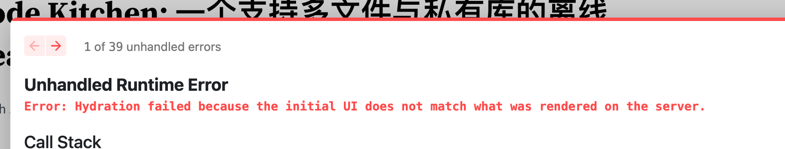

- [[Thoughtworks Radar]]
  - 看一看传统科技企业对于技术趋势的判断有点意思
  - 不过跟 [[state of js]] 一样，都是图一乐
- What is [[eBPF]]?
- [[ClojureScript UI frameworks]]
- [[React 18]] is released today
  id:: 6244201c-bfce-4c44-a8a4-dd4449d7ccf8
- Upgrade [[my personal blog]] for ((6244201c-bfce-4c44-a8a4-dd4449d7ccf8)). Failed for several reasons
  - mdx-bundler incorrectly import `react/jsx-runtime.js`
    - A tracking PR: https://github.com/kentcdodds/mdx-bundler/pull/162
    - Can be fixed by https://github.com/ds300/patch-package/issues/35
  - 
    - DONE Reports a lot of hydration errors.
    - Seems to be fixed in new Nextjs version
  -
