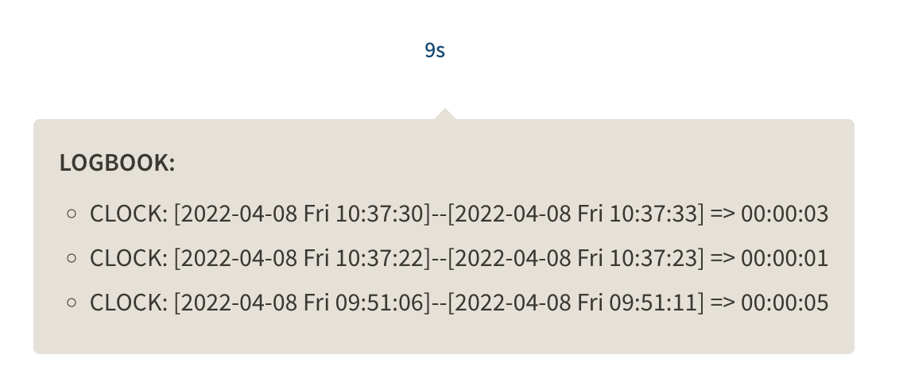

- [[Logseq]]
	- NOW better looking "clock-summary"? {:height 20, :width 105} this is scary! #[[Logseq Ideas]]
	  collapsed:: true
	  :LOGBOOK:
	  CLOCK: [2022-04-08 Fri 09:48:00]
	  :END:
		- 
		- The time is a sum of h/m/s cols and show as a "1h2m3s" string
		- Use `new Intl.RelativeTimeFormat('en', { style: 'narrow' })`? [[Web API INTL]]
		- Or use [[date-fns]]?
			- https://date-fns.org/v2.28.0/docs/formatDistance
			- I think this is still valuable even with the new Intl API
- Learn `useSyncExternalStore` API for [[React 18]]
-
-