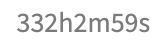

- [[Logseq]]
  collapsed:: true
  - LATER better looking "clock-summary"?
    :LOGBOOK:
    CLOCK: [2022-04-08 Fri 09:48:00]--[2022-04-14 Thu 11:50:49] => 146:02:49
    :END:
    - 
    - The time is a sum of h/m/s cols and show as a "1h2m3s" string
    - Use `new Intl.RelativeTimeFormat('en', { style: 'narrow' })`? [[Web API INTL]]
    - Or use [[date-fns]]?
      - https://date-fns.org/v2.28.0/docs/formatDistance
      - I think this is still valuable even with the new Intl API
    - {:height 20, :width 105} this is scary! #[[Logseq Ideas]]
- Learn `useSyncExternalStore` API for [[React 18]]
  id:: 6257927f-903b-4adf-8344-43832f23bd4d
  - In the following example, we can use `appStateStore.value = 'prompt'` to change the store state and let React to update the state even outside of a React component.
  - https://github.com/reactwg/react-18/discussions/86
    - ```ts
      import { useSyncExternalStore } from "react";

      // A super naive implementation of an external store
      class ExternalStore<T> {
        listeners: Set<() => void>;
        constructor(private _value: T) {
          this.listeners = new Set();
        }
        subscribe = (listener: () => void) => {
          this.listeners.add(listener);
          return () => {
            this.listeners.delete(listener);
          };
        };

        get value() {
          return this._value;
        }

        set value(v: T) {
          if (this._value !== v) {
            this._value = v;
            this.listeners.forEach((l) => l());
          }
        }

        snapshot = () => {
          return this.value;
        };
      }

      export const appStateStore = new ExternalStore<"hovering" | "prompt">(
        "hovering"
      );

      export const useAppStateStore = () => {
        return useSyncExternalStore(
          appStateStore.subscribe,
          appStateStore.snapshot
        );
      };
      ```
-
