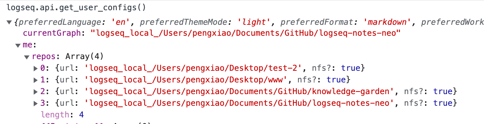

- LATER [[logseq]] Code in published graphs is not copyable
- Learnt from [[野生架构师Newsletter]] that we can even check if a number is prime or not using regular expression
- https://developer.chrome.com/100/
- [[Front-End Performance 2021: Planning And Metrics]]
- LATER [[Logseq Ideas]] - Peacock plugin?
	- similar to https://marketplace.visualstudio.com/items?itemName=johnpapa.vscode-peacock
	- DONE is there a way to list all graphs?
	  :LOGBOOK:
	  CLOCK: [2022-04-15 Fri 16:08:20]--[2022-04-15 Fri 16:08:21] =>  00:00:01
	  :END:
		- {:height 76, :width 670}
		- Already included in the user configs api
	-