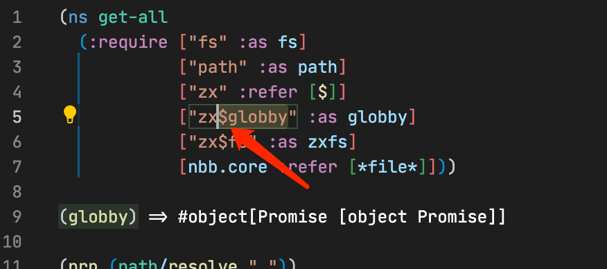

- Learnt fixtures in [[Playwright]] that is is very convenient to define test level utilities
	- left a comment in https://github.com/logseq/logseq/pull/5033#discussion_r857302326
- [[Learning Clojure]]
	- 
		- https://clojurescript.org/news/2021-04-06-release#_new_core_features
		- can use `$` to get the exported property of a library
-