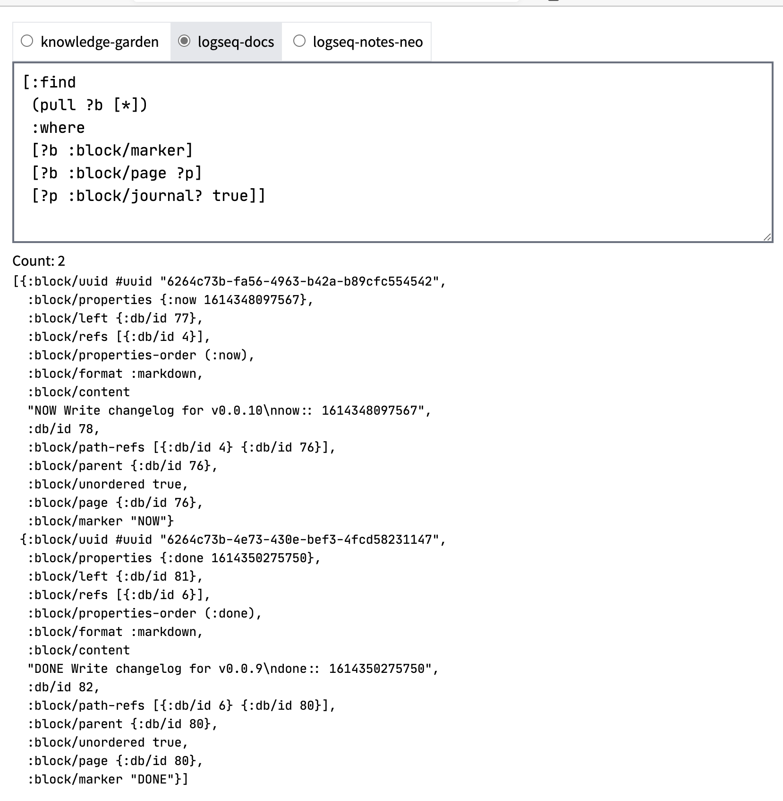

- DONE Building a hybrid web app to query Logseq #[[Learning Clojure]]
  :LOGBOOK:
  CLOCK: [2022-05-05 Thu 13:57:54]--[2022-05-05 Thu 13:57:55] =>  00:00:01
  :END:
	- learning basic [[Clojure web server]] implementation
		- [[ClojureScript]] + [[macchiato]] + [[reitit.ring]]
	- {:height 758, :width 570}
- `#js` literal #[[Learning Clojure]]
	- https://cljs.github.io/api/syntax/js-literal
	- may favor `clj->js` since the macro works recursively
	-