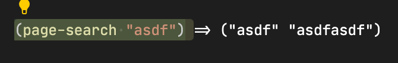

- 
	- React 的状态就应该放到全局!
- [[Logseq whiteboard with tldraw]]
	- ((62793896-81b7-4a97-a5db-7ac22841fef8))
	- DONE find out which event listener prevents the page from editing
	  :LOGBOOK:
	  CLOCK: [2022-05-15 Sun 14:21:58]--[2022-05-15 Sun 14:52:13] =>  00:30:15
	  :END:
	- DONE clear edit issue
	  :LOGBOOK:
	  CLOCK: [2022-05-15 Sun 14:52:26]--[2022-05-15 Sun 16:23:58] =>  01:31:32
	  :END:
		- `hide-when-esc-or-outside`?
		- An issue of `page-blocks-inner`: logseq relies on this to move to the next block
	- ((62818abc-bcd0-4a86-91c9-0f1c93495d2f))