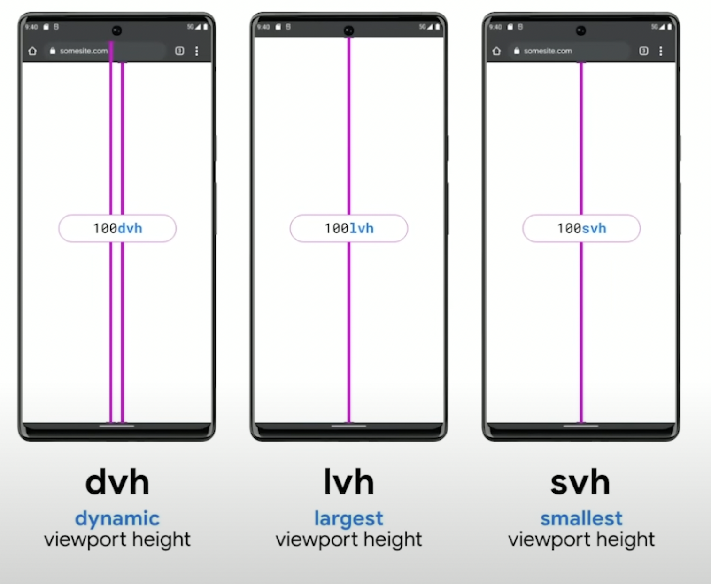

- https://web.dev/state-of-css-2022/
	- `inert` attribute to make other parts of the document non-interactive
	- More viewport units
		- {:height 414, :width 565}
	- `<selectmenu>` element
	-
- **Wheel Events** will be continuously fired until page completely stopped, with a decelerate in the delta (movement)
-