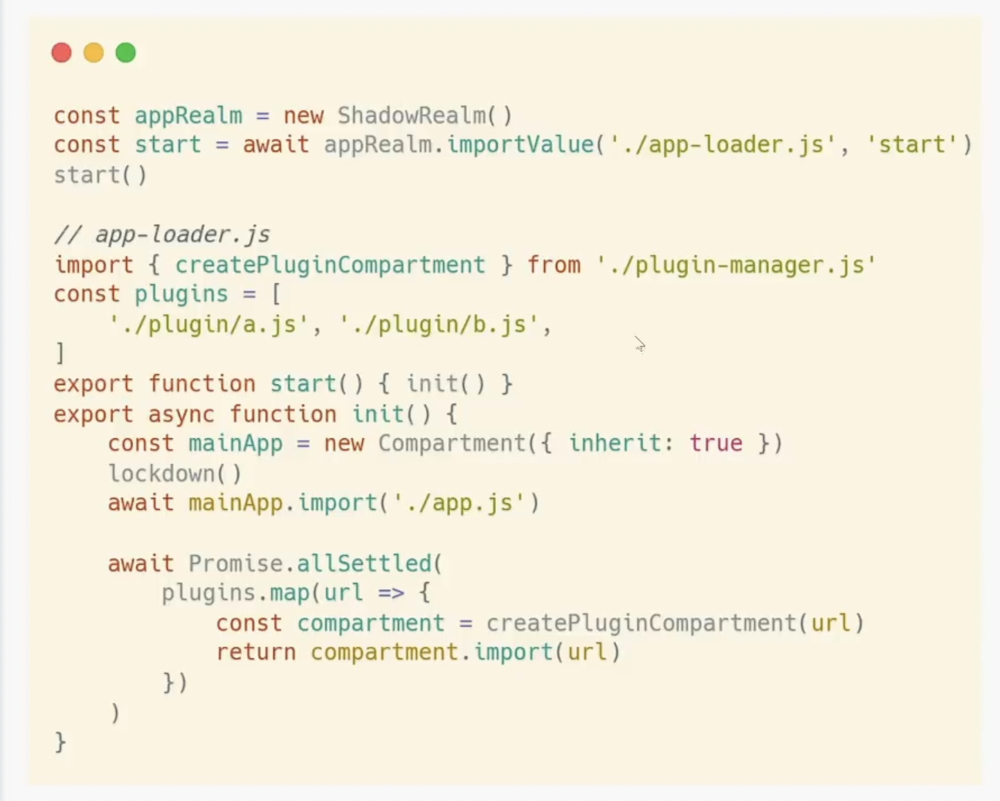

- DONE Jack Works on Supply Chain attack https://www.bilibili.com/video/BV14Y4y1z7Ar?spm_id_from=333.999.0.0 🔖
  id:: 6294371c-e069-485f-b662-0f1f496d246c
  :LOGBOOK:
  CLOCK: [2022-06-01 Wed 14:02:02]--[2022-06-01 Wed 15:06:50] =>  01:04:48
  :END:
	- Bilibili notes:
	  collapsed:: true
		- 01:26:02 · Proxy isArray
		  Array.isArray(proxyItem) works
		  01:28:38 · ShadowRealm 提案
		  
		  
		  01:29:53 · ShadowReal名字由来
		  
		  ShadowRealm 只能传递基础值与函数。对象是无法传的 （防止污染对象原型）
		  
		  01:30:53 · 函数特殊处理
		  
		  对函数有包装，这样函数内无法获得realm之外的值
		  无论如何也无法传递引用 
		  
		  01:36:03 · Record tuple
		  
		  这两个可以传，因为是 primitive。
		  
		  
		  
		  
		  01:36:27 · 为何设计如此简单
		  
		  特意设计的不好用，避免乱用。
		  
		  推荐使用库，而不是使用 API
		  
		  01:26:02 · Proxy isArray
		  
		  01:38:23 · Compartment AP
		  
		  Compartment 与 ShadowRealm 的关系？
		  
		  
		  
		  
		  01:40:42 · 模块图
		  
		  一个浏览器页面只有一个模块图，但是 Compartment 里模块的 import 重新执行。
		  
		  可以用来做虚拟化，比如测试。
		  
		  支持在 Compartment 之间共享模块
		  
		  
		  01:44:60 · resolveHook
		  
		  
		  有点像 esbuild playground 的实现
		  
		  ThirdPartyStaticModuleRecord
		  
		  01:56:13 · lockdown()
		  
		  目前可以用SES polyfill
		  
		  01:59:57 · 如何利用新API实现沙盒
		  
		  02:06:32 · 可撤销的proxy
		  
		  
		  02:07:42 · membrane可撤销能力库
		  
		  02:12:32 · SES
		  
		  lockdown polyfill
		  
		  Compartment API 差别很大
		  
		  02:29:41 · Comp vs Relam
		  
		  听起来 ShadowRealm 不如 Compartment 对于我们的需求，因为我们可以利用 Compartment 共享对象
	- ShadowRealm + Compartment example
	  id:: 6297104e-6891-48ac-aa07-56b9c134db6e
		- 
- DONE [[Logseq whiteboard with tldraw/pointer offset]]