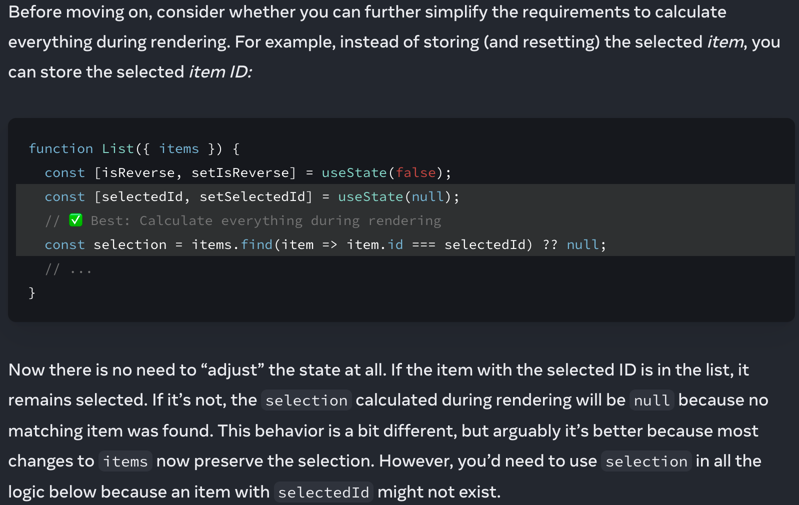

- [useState (reactjs.org)](https://beta.reactjs.org/apis/usestate#storing-information-from-previous-renders)
  id:: 62c1760f-7f52-45f8-b42f-80874754766f
	- {:height 452, :width 623}
	- It is even [stated in the old site](https://reactjs.org/docs/hooks-faq.html#how-do-i-implement-getderivedstatefromprops)
	- TBH this shocks me and makes me think that my 3 years on React is in ruins