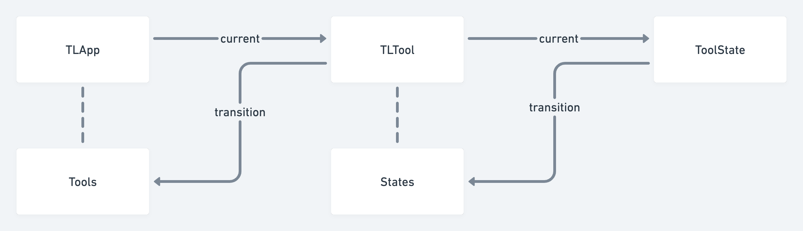

- DONE Refactored how to create LogseqPortalShape (without draft and activated)
	- By implementing a dedicated Logseq tool state
	- 
	- May need to separate quick add action and make it "shapeless" ?
- [[Logseq whiteboard with tldraw/save as logseq page]]