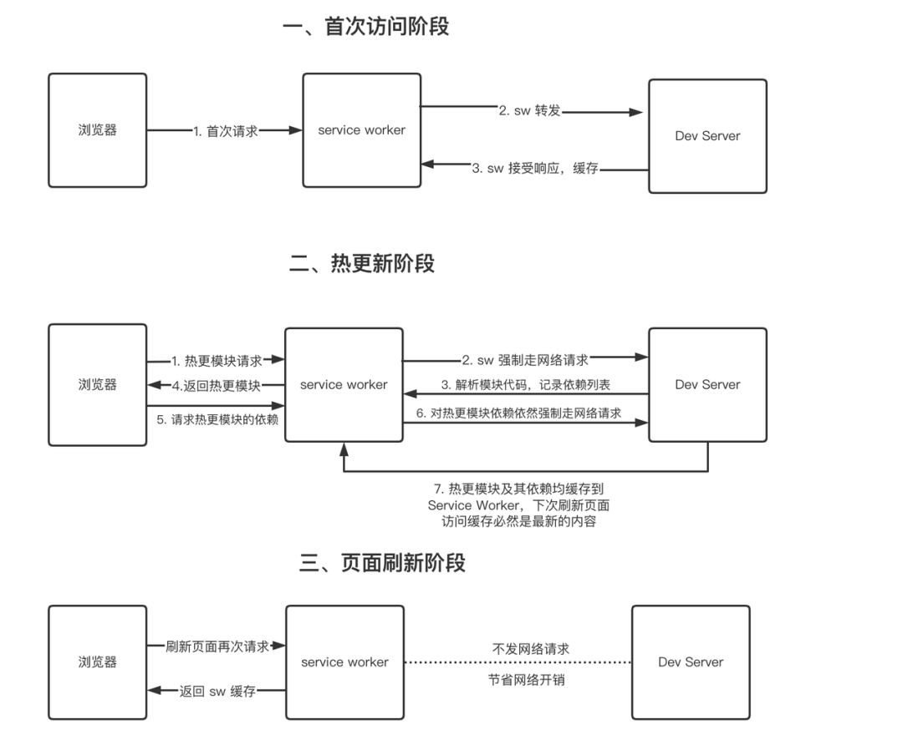

- [[Logseq whiteboard with tldraw]]
	- DONE A bug reported on Logseq quick add prompt closing every a few seconds
	  :LOGBOOK:
	  CLOCK: [2022-08-23 Tue 10:29:38]--[2022-08-23 Tue 12:16:47] =>  01:47:09
	  :END:
		- I suspect this is triggered by circling back persisted data into the tldraw app
- Vite start up time for large code base
	- the first startup time is very slow for Logseq tldraw demo
		- seems to be caused by tailwind purge rule
	- Related post [Bundle-less 的思考和实分享](https://mp.weixin.qq.com/s/nk5SN8AKwyFkUTEOiLCBdQ)
		- {:height 349, :width 526}
		- https://github.com/vitejs/vite/issues/1309
			- cache the files with a service worker, that after the first load, at least any consecutive load would be fast, and when a module is being changed that info can be transmitted by the hmr mechanism/websocket and deprecate the out of dated module.
	- Good article on optimizing https://carljin.com/vite-resolve-request-files-a-ton.html
	-