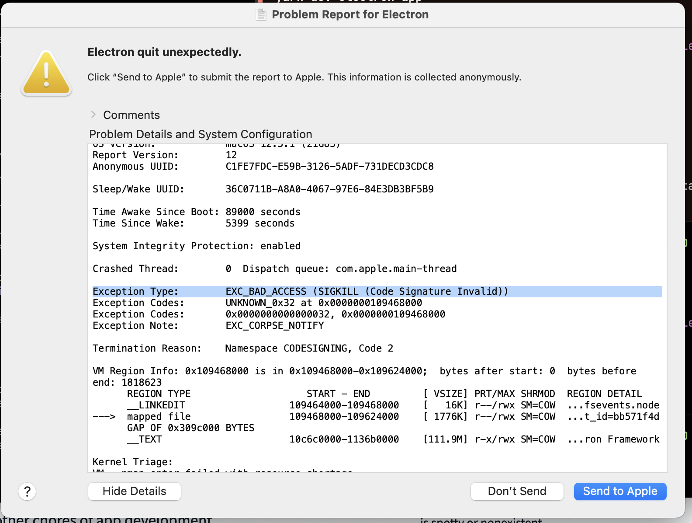

- {{tweet https://twitter.com/steveruizok/status/1566142910546038784}}
	- why two stacks?
		-
- Struggling Electron quit unexpectedly for Logseq development
	- There is an issue on Mac, starting probably early this week that Logseq running in electron dev mode immediate crashes after running with  `yarn dev-electron-app` . In the crash report, it prompts an error   `EXC_BAD_ACCESS (SIGKILL (Code Signature Invalid))`   in the crash report. Any ideas on how to fix this?
	- The error is gone after I remove the `/static` dir and rebuild. But the error is back after restarting
		- {:height 613, :width 831}
	- links maybe related
		- https://github.com/electron-userland/electron-builder/issues/3989
			- This contains a lot of
		- And another one https://github.com/electron-userland/electron-builder/issues/4040#issuecomment-553327682
	- Some user mentioned that manually signing may help?
		- https://forum.sublimetext.com/t/crashing-with-termination-reason-namespace-codesigning-code-0x2/54518
		- But I did not even know where is the Electron app
			- `/Users/pengxiao/Documents/GitHub/logseq/static/node_modules/electron/dist/Electron.app/Contents`?
	- Logseq did change [codesigning in GitHub action](https://github.com/logseq/logseq/pull/6522/files), however seems not related
	- Restarting with `electron-forge start --inspect-electron --enable-logging`
	- `bootstrap_look_up com.deeplink.logseq.MachPortRendezvousServer.45931: Permission denied (1100)`
		- this throws at every first full-rebuild run. What is it?
	-
-