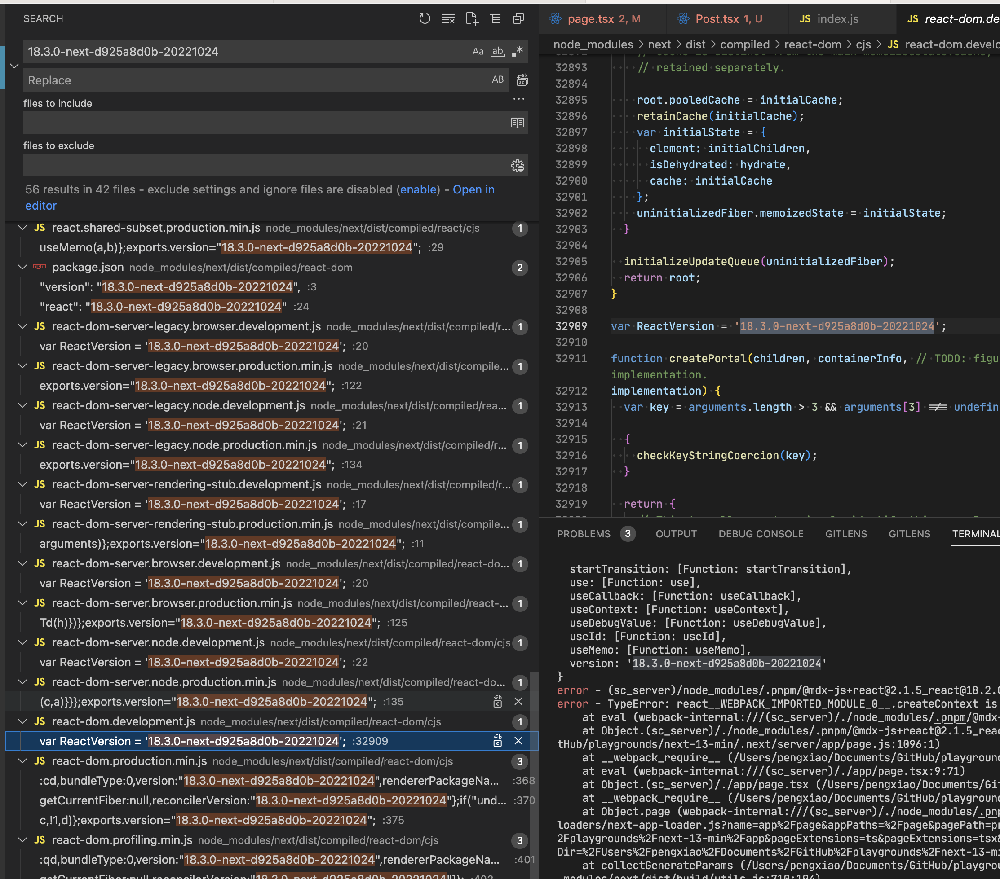

- [[Nextjs conf]]
  collapsed:: true
	- Official Example https://github.com/vercel/next.js/tree/canary/examples/with-turbopack
	  collapsed:: true
		- ```
		  pnpm create next-app --example with-turbopack
		  ```
	- [[Turbopack]]
	  collapsed:: true
		- [[turbo]]
	- [[Nextjs 13]]
		- ## [Migrating from  `pages`  to  `app` ](https://beta.nextjs.org/docs/upgrade-guide#migrating-from-pages-to-app)
		  collapsed:: true
			- New routing system
			  collapsed:: true
				- [Route groups](https://beta.nextjs.org/docs/routing/defining-routes#route-groups)
				  collapsed:: true
					- {:height 201, :width 643}
					- It is a way to define a logic file structure without affecting the real routing
					- However the layout will be shared in the group
					- A typical use case here is to create multiple root layout
					- Routes inside route groups should not resolve to the same URL path. For example, since route groups don't affect the URL structure, the following combination would both resolve to  `/about`  and cause an error:  `(marketing)/about/page.js`  and  `(shop)/about/page.js` .
				- Nested route is providing nested views via `children` prop
				  collapsed:: true
					- 
			- By default, components inside  `app`  are [React Server Components](https://beta.nextjs.org/docs/rendering/server-and-client-components). This is a performance optimization and allows you to easily adopt them. However, you can also use [Client Components](https://beta.nextjs.org/docs/rendering/server-and-client-components#client-components).
			- Special routes
			  collapsed:: true
				- [**page.tsx**](https://beta.nextjs.org/docs/routing/pages-and-layouts#pages): A file used to define the unique UI of a route. Pages represent the leaf of the route and are needed for the path to be accessible.
				- [**layout.tsx**](https://beta.nextjs.org/docs/routing/pages-and-layouts#layouts): A file used to define UI that is shared across multiple pages. A layout accepts another layout or a page as its child. You can nest layouts to create nested routes.
				- [**loading.tsx**](https://beta.nextjs.org/docs/routing/loading-ui): An optional file used to create loading UI for a specific part of an app. It automatically wraps a page or child layout in a [React Suspense Boundary](https://beta.reactjs.org/apis/react/Suspense#suspense), showing your loading component immediately on the first load and when navigating between sibling routes.
				- [**error.tsx**](https://beta.nextjs.org/docs/routing/error): An optional file used to isolate errors to specific parts of an app, show specific error information, and functionality to attempt to recover from the error. It automatically wraps a page or child layout in a [React Error Boundary](https://reactjs.org/docs/error-boundaries.html). Showing your error component whenever an error in a subtree is caught.
				- [**template.tsx**](https://beta.nextjs.org/docs/routing/pages-and-layouts#templates): An optional file, similar to layouts, but on navigation, a new instance of the component is mounted and the state is not shared. You can use templates for cases where you require their behavior, such as enter/exit animations.
				- [**head.tsx**](https://beta.nextjs.org/docs/routing/pages-and-layouts#modifying-head): An optional file used to define the contents of the  `<head>`  tag for a given route.
		- Components in `app` are [[RSC]] by default
		  collapsed:: true
			- Vercel provides a node package to constraint a module is server only `server-only`
			  collapsed:: true
				- ```js
				  import "server-only";
				  
				  export async function getData() {
				    let resp = await fetch("https://external-service.com/data", {
				      headers: {
				        authorization: process.env.API_KEY,
				      },
				    });
				  
				    return resp.json();
				  }
				  ```
		- Client Component
		  collapsed:: true
			- To use a Client Component, create a file inside  `app`  and add the [ `"use client"`  directive](https://github.com/reactjs/rfcs/pull/227) as the first line of code.
			- `app/Counter.js`
			- ```jsx
			  'use client';
			  
			  import { useState } from 'react';
			  
			  export default function Counter() {
			    const [count, setCount] = useState(0);
			  
			    return (
			      <div>
			        <p>You clicked {count} times</p>
			        <button onClick={() => setCount(count + 1)}>Click me</button>
			      </div>
			    );
			  }
			  ```
			-
		- Font
		  collapsed:: true
			- While [inlining CSS](https://nextjs.org/docs/basic-features/font-optimization.md) still works in  `pages` , it does not work in  `app` . You should use [ `next/font` ](https://beta.nextjs.org/docs/optimizing/fonts) instead.
	- Q: How to render non-js pages like mdx?
	  id:: 63590b1a-0332-40f4-93a7-4446a6982c58
	  collapsed:: true
		- **Seems not yet supported**
- **Communities around the React & Vercel collaboration**
  background-color:: yellow
  collapsed:: true
	- {{tweet https://twitter.com/BenLesh/status/1585438392246210560}}
	- A: “Next 13 is the real React 18 release”
	  collapsed:: true
		- {{tweet https://twitter.com/dan_abramov/status/1585408185451642880}}
		- https://twitter.com/acdlite/status/1549853625673023488
		- https://twitter.com/t3dotgg/status/1584970055426932736
	- `use` will be released in [[React 18.3.0]] and it is now included in a beta version, one day before Next.js conf 😳
		- Next.js is actually using a beta build of React that is prebuilt into their assets
		  collapsed:: true
			- 
		- See the PR https://github.com/vercel/next.js/pull/41708
	- {{tweet https://twitter.com/AdamRackis/status/1585431835789639680}}
	- Dan's comment on [[Remix]]
	  collapsed:: true
		- {{tweet https://twitter.com/dan_abramov/status/1585409622948675590}}
	- Q: turbopack isn’t 1:1 api with Webpack, what’s the plan for migration
	  collapsed:: true
		- https://twitter.com/t3dotgg/status/1584969850442911745
	- Parcel author's comment
	  collapsed:: true
		- {{tweet https://twitter.com/devongovett/status/1585463496354865153}}