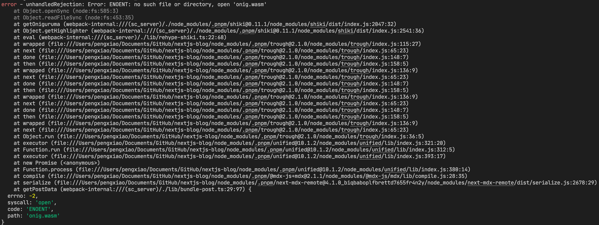

- [[App Directory in Next.js 13]]
	- Shika wasm load issue. Also, why it is **loaded in webpack-internal context**?
		- The issue of Shika load is that when in the node context, it is using ``
		- 
	- Created a PR to workaround with that https://github.com/shikijs/shiki/pull/370. But I guess
	-