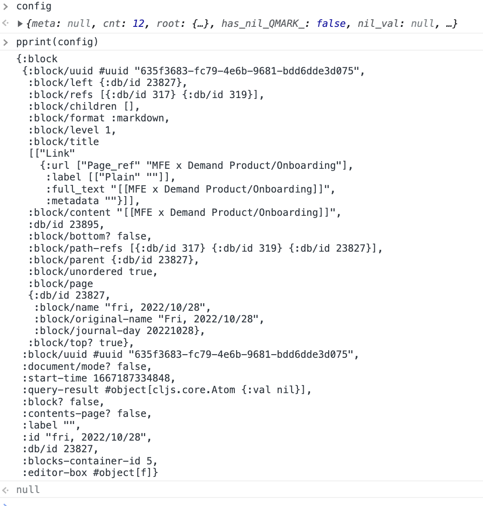

- #TIL Inspect/debug CLJS variables in Logseq desktop app
	- add `(set! (.-pprint js/window) pprint/pprint)` to `core.cljs`
	- set debugger in code and run `pprint(var)` in dev tools console
		- {:height 555, :width 422}