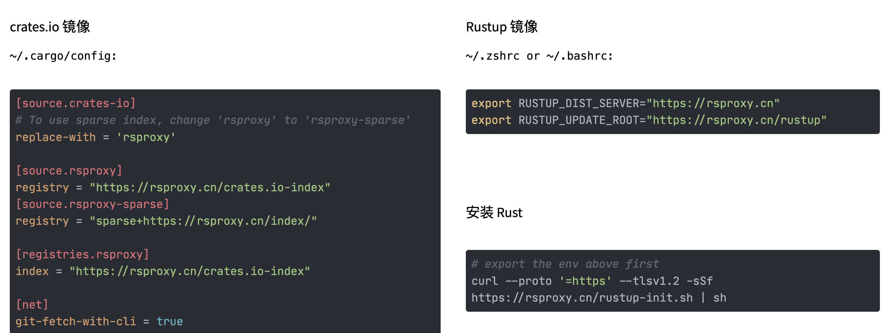
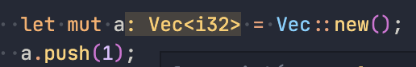
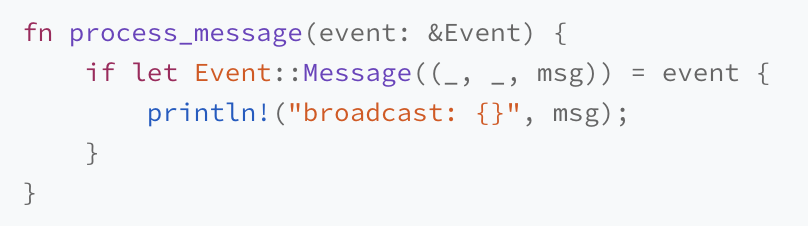

- Starting to learn [[Rust Lang]] by Chen Tian's Rust course https://time.geekbang.org/column/article/408409
	- feels much harder than previous languages - need to retake some fundamental CS
		- e.g., a string literal is stored in rodata, when copied to heap using `to_string` it will return a fat pointer with 3 parts: pointer, size and capacity
		  id:: 63a3ca04-6d48-4675-98a6-a1f6ed6d1dde
	- things to watch for
		- only see string literal use to_string to creating heap, but not seeing mem release?
	- Installing tools & vscode
		- https://rsproxy.cn/
			- 
		- after installed rust-analyzer, we may also need to enable proxy in vscode:
			- {:height 522, :width 655}
		-
	- defining functions
		- function parameter & return values must be explicitly typed. If the last expression in the function has no `;` at the end of the line, it will be the return value. If there is `;`, the return value is a void unit `()`
	- what is "borrow" and "move" in the context?
		- borrow: https://www.educative.io/answers/how-to-use-references-in-rust
			- When a function takes in a reference as a parameter, it is called borrowing.
			- Multiple *mutable* references to the same variable cannot exist within one scope.
			- A value cannot be borrowed as both immutable ref & mutable ref
	- 
		- type inference support backward tracking?
	- `2u8` number literal with the type to specify the type inline
	- there is no auto cast. eg., cannot compare i32 with u8 directly.
	- pattern match syntax sugar
		- 
	- use `mod` to import native modules, use `use` to import crates