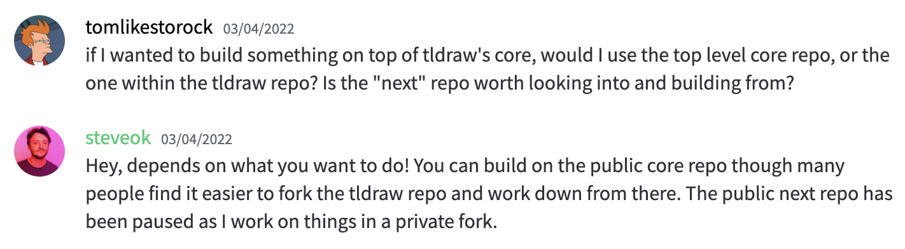

- Seems [[tldraw]] is pretty stable since Jan.
- does [[tldraw next]] provide custom shape definitions?
- Joined the discord channel
- Found [tldraw.dev](https://www.tldraw.dev/) in [discord](https://discord.com/channels/859816885297741824/914873545388064860/966228764600197140)
	- tldraw provides the components and services you need to create whiteboards, creative tools and canvas experiences in your product.
	- The author is building the next repo in a private fork [ref](https://discord.com/channels/859816885297741824/926464446694580275/949283831767244821)
	- {:height 120, :width 787}
	- I guess we could get a working version as the demo (not planning to use this as for long term purpose)?