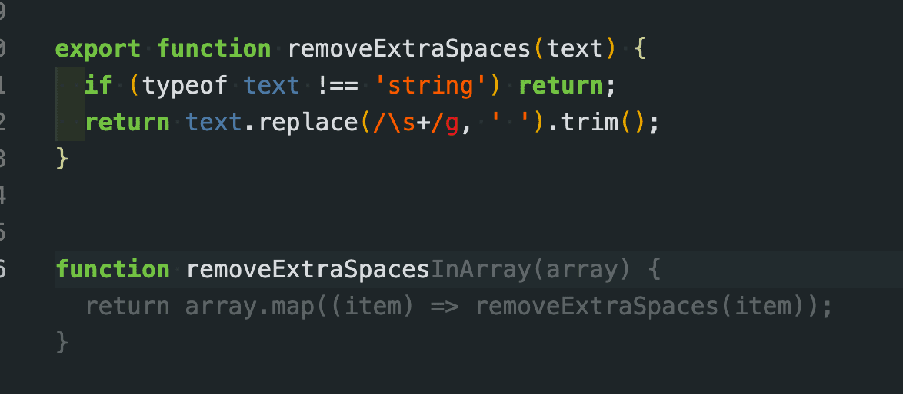

updated-at:: 1626358669833
created-at:: 1626358669833
tags:: cool tech, frontend brown bag
type:: [[blogpost]]

- ### What is _GitHub Copilot_
  updated-at:: 1626358642727
  created-at:: 1626358243188
	- GitHub Copilot is powered by [[Codex]], the new AI system created by [[OpenAI]]
	  created-at:: 1626358773168
	  updated-at:: 1626358773168
		- compared with [[GPT3]] which is good at writing in natural human language, Codex is good at code generation
		  created-at:: 1626362364604
		  updated-at:: 1626362364604
	- partnership between [[Microsoft]] and [[OpenAI]] — which Microsoft invested $1 billion into two years ago.
	  created-at:: 1626362380568
	  updated-at:: 1626362380568
	- An powerful autocomplete tool to guess your intent which yourself may don't know
	  created-at:: 1626364303814
	  updated-at:: 1626364303814
		- {:height 340, :width 749}
		  updated-at:: 1626363823477
		  created-at:: 1626361254621
	- A cool intro
	  created-at:: 1626364737195
	  updated-at:: 1626364737195
		- {{youtube https://www.youtube.com/watch?v=4duqI8WyfqE}}
		  created-at:: 1626363831653
		  updated-at:: 1626364312087
	- Peoples reactions
	  created-at:: 1626364743542
	  updated-at:: 1626364743542
		- [:div {:style {:font-size 48}} "🤯 😓 😱"]
		  created-at:: 1626364735430
		  updated-at:: 1626364744354
	- Amazon also has a paid service: [[Amazon CodeGuru]]
	  created-at:: 1626364772782
	  updated-at:: 1626364772782
### What is it good at?
created-at:: 1626358505272
updated-at:: 1626358505272
	- There is some good examples on [its website](https://copilot.github.com/)
	  created-at:: 1626358711919
	  updated-at:: 1626358711919
		- _StackOverflow:_ Skip the docs and stop searching for examples.
		  created-at:: 1626361164781
		  updated-at:: 1626361164781
			- e.g., Convert **comments** to code, guess your code's intent which yourself may don't know, Autofill for **repetitive** code, **Tests** without the toil
			  created-at:: 1626361910104
			  updated-at:: 1626361910104
		- generating common utility functions
		  created-at:: 1626362022200
		  updated-at:: 1626362022200
			- {:height 283, :width 676}
			  created-at:: 1626362023467
			  updated-at:: 1626362026938
		- When you want to start something that is not familiar to you
		  created-at:: 1626361828021
		  updated-at:: 1626362022461
		- Can even help you to write `README.md` files
		  created-at:: 1626361846911
		  updated-at:: 1626361846911
### What is it bad at?
created-at:: 1626361790582
updated-at:: 1626361790582
	- to deal with complex codes, external libraries, component (web) styles, biz logic
	  created-at:: 1626362937263
	  updated-at:: 1626362937263
	- useful for simple projects but maybe not ready for prime time.
	  created-at:: 1626365342105
	  updated-at:: 1626365342105
	- the code autocomplete latency is restricted by the network
	  created-at:: 1626365376006
	  updated-at:: 1626365376006
### Is it evil?
created-at:: 1626363479324
updated-at:: 1626363479324
	- meme
	  created-at:: 1626363448423
	  updated-at:: 1626363456171
	  collapsed:: true
		- 
		  created-at:: 1626358402085
		  updated-at:: 1626363446669
	- #### Conflicts with open source license
	  collapsed:: true
	  created-at:: 1626363590037
	  updated-at:: 1626363590037
		- it is trained on all public repos in GitHub, no matter what is the license, but some open source licenses don’t allow derivative works
		  created-at:: 1626363555913
		  updated-at:: 1626363555913
	- #### Leaking sensitive personal data
	  created-at:: 1626363548439
	  updated-at:: 1626363555078
	  collapsed:: true
		- For the technical preview, we have implemented a rudimentary filter that blocks emails when shown in standard formats, but it’s still possible to get the model to suggest this sort of content _if you try hard enough_.
		  created-at:: 1626363456161
		  updated-at:: 1626363547096
	- #### Telemetry issues
	  collapsed:: true
	  created-at:: 1626362455929
	  updated-at:: 1626363572028
		- In order to generate suggestions, GitHub Copilot transmits part of the file you are editing to the service., [src](https://copilot.github.com/#faq-how-is-the-data-that-github-copilot-collects-used)
		  created-at:: 1626361641332
		  updated-at:: 1626361641332
		-
		  created-at:: 1626361632916
		  updated-at:: 1626361643181
## references
created-at:: 1626362989875
updated-at:: 1626362989875
- https://thenewstack.io/github-copilot-a-powerful-controversial-autocomplete-for-developers/
  created-at:: 1626363001865
  updated-at:: 1626363001865
- https://www.infoworld.com/article/3624688/developers-react-to-github-copilot.html
  created-at:: 1626363002709
  updated-at:: 1626363002709