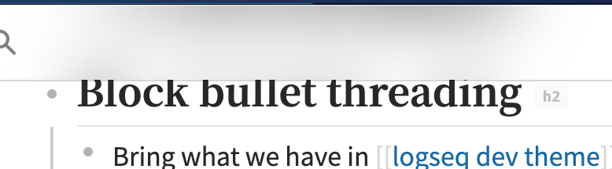

- ## Fonts
  id:: 60f5a308-8222-403a-8a10-ca38f55c9843
  - Inter is not a good article font, I think
  - How about having 3 category like the following:
    - sans-serif: ~~[Noto Sans](https://fonts.google.com/specimen/Noto+Sans) for normal texts~~ use [[source sans]] (variable font) instead
    - serif: ~~[Noto Serif](https://fonts.google.com/specimen/Noto+Serif) for titles~~ we will also use sans
    - monospace: [Fira Code](https://fonts.google.com/specimen/Fira+Code?query=fira+code) for codes
    - bonus: for Noto Sans/Serif ([[思源字体]]黑/宋), we can use different derivatives based on the current user language setting. E.g., use **Noto Sans SC** for **简体中文**, **Noto San TC** for 繁體中文 etc.
      id:: 60ff651c-a11b-407b-8bfd-e70a1a898f23
    - ((60ff651c-a11b-407b-8bfd-e70a1a898f23))
- ## Popover & Query block
  id:: 60f6ed57-eecb-4c56-82d0-e2b36c07eaad
  - background is too dim and we want to have a clearer boundary
  - make titles a bit more standing out
- ## Block bullet threading
  id:: 60f6f22e-9bf6-4a17-acb3-8d614ed8a175
  - Bring what we have in [[logseq dev theme]]?
    - This might be added as a toggle into the setting
    - {:height 237, :width 198}

## Nav Bars & title

id:: 60f5a308-78d7-4ec6-8bbe-19d753004709 - backdrop blur - 磨砂玻璃效果 - {:height 115, :width 540} - sticky title position in right side bar

- ## Other non critical ones
  - ## Dark / Light Theme Variants
  - ## Cleanups
    - The selectors are added too causally
  - ## Graph
    id:: 60f5871f-ac0b-4b21-8443-6c8d5e64beeb
    - blurry issue

# Thoughts 💭

- In my opinion, ((60f5a308-8222-403a-8a10-ca38f55c9843)), ((60f6ed57-eecb-4c56-82d0-e2b36c07eaad)) are two key issues to revamp light theme
- ((60f6f22e-9bf6-4a17-acb3-8d614ed8a175)) is a nice-to-have
