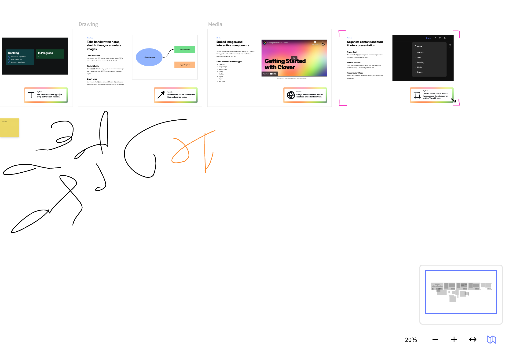

title:: Logseq whiteboard with tldraw/preview

- Server side tldraw export as image, powered by AWS lambda + Puppeteer
	- https://gist.github.com/steveruizok/c30fc99b9b3d95a14c82c59bdcc69201
- Client side
	- iterate each shapes, copy the SVG of each shape and put them in a `g` element
	- LATER Question: is this can be done without creating actual nodes?
	  :LOGBOOK:
	  CLOCK: [2022-06-08 Wed 14:10:40]
	  :END:
		- I think most of the data required for drawing are already there in the .tldr file. Shape rendering is done by rendering the components, which are either raw HTML elements or SVG.
		- Should we split the SVG rendering from React component, so that this can be used for both rendering & export
- ---
- How Cloverapp renders minimap:
	- draw only the bounding rectangles of each shape with a `0.2` opacity background
- {:height 328, :width 494}
-
-