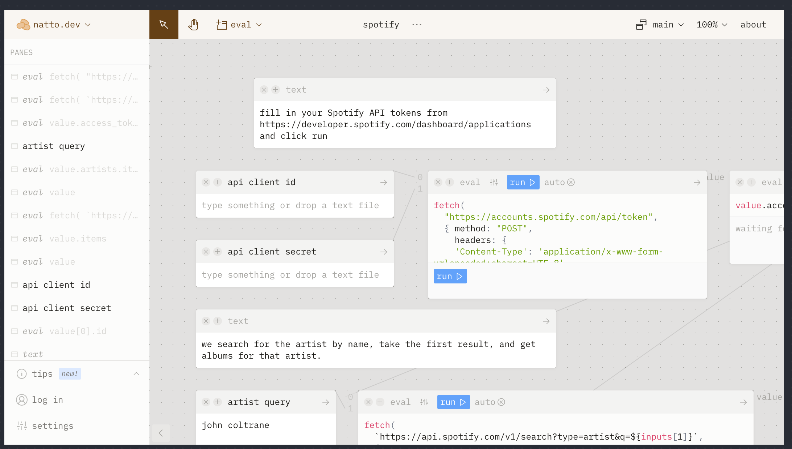

- [pengx17/logseq-dev-theme: logseq, theme](https://github.com/pengx17/logseq-dev-theme)
# H1 Title
- ## H2 Sub Title
- ### H3 Section Title
- #### H4 Section Sub Title
- ##### H5 mini title
- `Inline Code` ^^Highlighted^^ Normal Text
- Some text that will be referenced
  id:: 60d34662-6747-46cd-a790-6dcb691b0256
	- LATER [#A] high priority task
	  waiting:: 1624459006771
	  later:: 1624459014212
	- WAITING [#B] high priority task
	  done:: 1624458986941
	  now:: 1624458985140
	  later:: 1624458989486
	  waiting:: 1624459000961
	- CANCELED [#C] Canceled task
		- NOW working task
		  later:: 1624459087696
		  now:: 1624459089292
- Progress Bar [:progress {:max 10 :value 3}]
- Block ref  ((60d34662-6747-46cd-a790-6dcb691b0256)) [[logseq]]
- ((60d34662-6747-46cd-a790-6dcb691b0256))
- Embedded block
	- {{embed ((60d34662-6747-46cd-a790-6dcb691b0256))}}
- [[汉字测试]]
- IMAGE
	- {:height 285, :width 467}