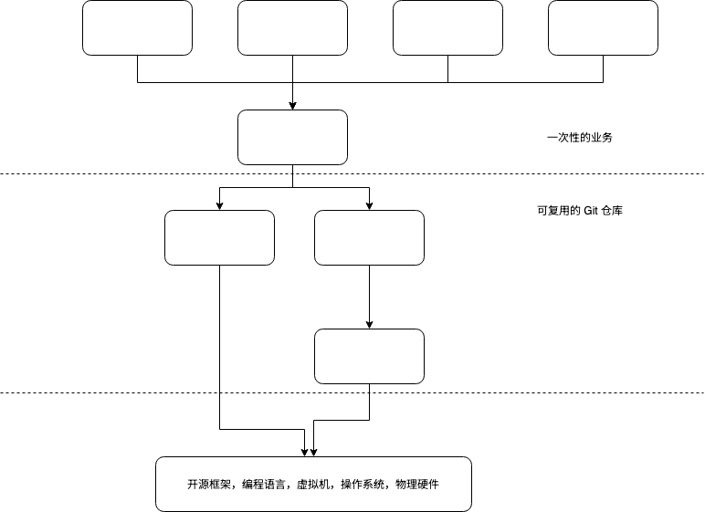

tags:: 架构设计
src:: https://autonomy.design/
stars::  ⭐⭐⭐⭐⭐

# 症状

- ## 如果没有做好业务逻辑拆分，可能在项目晚期造成以下三种问题：
  - 拆了微服务之后做一个需求要拉很多人，代码写进来了就再也删不掉了
  - 要么放任自流，1 个 App 里有 4 种日期选择方式。要么用力过猛，抽象出来的营销接口动辄几百个参数
  - 线上出了问题很难定位到谁引起的，本地做不了任何有意义的测试，反馈周期特别长
- 这个本质约束就是人类的感知与沟通速度是很慢的。 所谓业务架构，其实^^质就是想尽一切办法减少沟通^^。

## 组合

    -
      src:: https://autonomy.design/Part1/Composition.html
    - 这个依赖相加/相乘关系有点意思
    - {:height 446, :width 523}
    - 我们有的UI业务模块会封装为库作为npm包管理
    	- 涉及到版本号变化，需要业务方自己判断是否需要更新
    	- 可以做到低版本一直可以兼容高版本api
