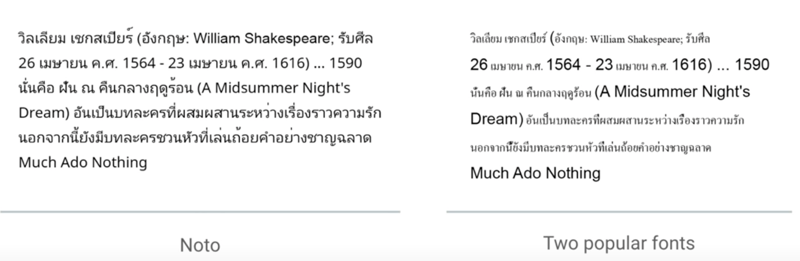

type:: blogpost
alias:: Source Sans, Source Serif, Noto, No More Tofu
wiki:: https://zh.wikipedia.org/wiki/%E6%80%9D%E6%BA%90%E9%BB%91%E9%AB%94
tags:: typeface

- Noto or 思源?
  id:: 62d8bccb-ffd6-44d4-8bbf-6fcc6d329d75
	- Makers: **Adobe**, [Google](https://www.google.com/get/noto/), Monotype
	  id:: 62d8bccb-9abb-4152-9a1c-4756b6e52d75
	- [Font Chat Room: Noto Serif CJK—A font about...Tofu?](https://www.youtube.com/watch?v=V4jKzjWg4KQ) ⭐
- 思源黑体（英语：Source Han Sans)，“思源”一词来自于成语“饮水思源”。
- asdasdf -> asdsad
- 思源黑(宋)體：Adobe 與 Google 合作開發免費中文字型
  id:: 62d8ba4c-b12d-4606-96d9-14e62a80dbde
	- https://developers.googleblog.com/2014/07/noto-cjk-font-that-is-complete.html
	- https://developers.googleblog.com/2017/04/noto-serif-cjk-is-here.html
	- [Google’s International Fonts Noto — One Font to Rule Them All](https://www.youtube.com/watch?v=AAzvk9HSi84) - youtube
	  collapsed:: true
		- harmony look and feel across languages
		  collapsed:: true
			- 
	- Noto Sans, Noto Serif
		- https://developers.googleblog.com/2017/04/noto-serif-cjk-is-here.html
		- 对于 CJK 字体，被称为思源黑体/宋体
		- Noto Sans 和 Source Hans 实际上指的同一字体，只是在 Google 和 Adobe 的上下文中商标名称不同
		- 這款字型共分為七種粗細，包括 ExtraLight、Light、Normal、Regular、Medium、Bold 和 Heavy
		- 对于普通西文，我们可以直接使用 `Noto Sans` 或者 `Noto Serif`
	- 日文、韓文、繁體中文及簡體中文 (CJK) 提供完整支援 `Noto Sans SC`, `Noto Sans JP`, etc
	  collapsed:: true
		- 
	- 支持 300 多种语言, 超过 10 万种字符
- [請還原 Traditional Chinese 的眞正 Tradition 寫法 #6](https://github.com/adobe-fonts/source-han-sans/issues/6)
- 宋體 / 明體
	- 繁体世界中，宋体被称为明体，但实际上是同一种字形
- Variants
	- https://free.com.tw/genshin-font 思源真黑體
	- https://free.com.tw/genjyuu-font 思源柔黑體
## Demo
### 思源黑体
	- [:span {:style {:font-family "Source Han Sans VF" :font-size 24}} "永意风国今警我然转随鹰酬"]
## References
collapsed:: true

collapsed:: true
-
-
-
- ((626bf4a6-d48a-4fcb-9aa9-24ca992cf983))