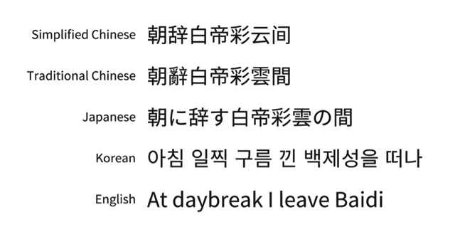

type:: blogpost

- 思源黑(宋)體：Adobe 與 Google 合作開發免費中文字型
	- Noto Sans, Noto Serif
	- 思源黑体，思源宋体
	- Noto Sans 和 Source Hans 实际上指的同一字体，只是在Google和Adobe的上下文中商标名称不同。
	- 這款字型共分為七種粗細，包括 ExtraLight、Light、Normal、Regular、Medium、Bold 和 Heavy
	- 日文、韓文、繁體中文及簡體中文 (CJK) 提供完整支援
		- 
- Variants
	- https://free.com.tw/genshin-font 思源真黑體
	- https://free.com.tw/genjyuu-font 思源柔黑體
## Demo
### 思源黑体
	- [:span {:style {:font-family "Noto Sans SC" :font-size 24}} "永意风国今警我然转随鹰酬"]
### 思源宋体
	- [:span {:style {:font-family "Noto Serif SC" :font-size 24}} "永意风国今警我然转随鹰酬"]
- ## References
  collapsed:: true
	- https://free.com.tw/source-han-sans-noto-sans
	- https://free.com.tw/genseki-font/